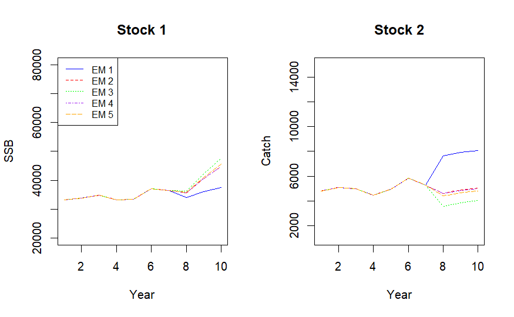

## Perform Management Strategy Evaluation

This vignette demonstrates how to use the `whamMSE` (Woods Hole Assessment Model Management Strategy Evaluation) package to conduct management strategy evaluation. **Note:** all code shown here is for demonstration purposes only; the results are for illustrative use and should not be interpreted as reflecting real-world stock assessments.

### 1. Load `wham` and `whamMSE`

```{r, eval=FALSE}
library(wham)
library(whamMSE)

main.dir = here::here()
```

### 2. Generate Basic Information

We define 2 regions, each with a stock and corresponding fleets and surveys. Four seasons are used. To save time, the burn-in period is 20 years, and the feedback period is 3 years. Fishing history starts at 0.2, rises to 0.4 mid-period, and returns to 0.2 by the end. The CV is 0.1 for both catch and index data, with effective sample size 100; surveys occur at 0.625 fraction of the year with catchability of 0.2. Fish spawn at 0.625 fraction of the year.

```{r, eval=FALSE}
year_start <- 1
year_end   <- 20
MSE_years  <- 3

info <- generate_basic_info(
  n_stocks = 2,
  n_regions = 2,
  n_indices = 2,
  n_fleets = 2,
  n_seasons = 4,
  base.years = year_start:year_end,
  n_feedback_years = MSE_years,
  life_history = "medium",
  n_ages = 12,
  F_info = list(F.year1 = 0.2, Fhist = "F-H-L", Fmax = 2, Fmin = 1, change_time = 0.5),
  catch_info = list(catch_cv = 0.1, catch_Neff = 100),
  index_info = list(index_cv = 0.1, index_Neff = 100, fracyr_indices = 0.625, q = 0.2),
  fracyr_spawn = 0.625
)

basic_info = info$basic_info
catch_info = info$catch_info
index_info = info$index_info
F_info     = info$F
```

### 3. Specify Movement

We use `generate_NAA_where()` and `generate_move()` to configure natal homing dynamics with bidirectional movement (move.type = 2). Movement rates, variation, and priors are set accordingly.

```{r, eval=FALSE}
basic_info <- generate_NAA_where(basic_info, move.type = 2)
move <- generate_move(
  basic_info = basic_info,
  move.type = 2,
  move.rate = c(0.3, 0.1),
  move.re = "iid_y",
  move.sigma = 0.5,
  prior.sigma = 0.5,
  use.prior = TRUE
)
```

### 4. Configure Selectivity

```{r, eval=FALSE}
n_stocks  <- as.integer(basic_info['n_stocks'])
n_regions <- as.integer(basic_info['n_regions'])
n_fleets  <- as.integer(basic_info['n_fleets'])
n_indices <- as.integer(basic_info['n_indices'])
n_ages    <- as.integer(basic_info['n_ages'])

fleet_pars <- c(5, 1)
index_pars <- c(2, 1)
sel <- list(
  model = rep("logistic", n_fleets + n_indices),
  initial_pars = c(rep(list(fleet_pars), n_fleets), rep(list(index_pars), n_indices))
)
```

### 5. Configure Numbers-at-Age (NAA)

```{r, eval=FALSE}
sigma      <- "rec+1"
re_cor     <- "iid"
ini.opt    <- "equilibrium"
alpha <- 12
beta  <- 1.5e-4

NAA_sig <- 0.2
sigma_vals <- array(NAA_sig, dim = c(n_stocks, n_regions, n_ages))
log_N1 <- rep(10, n_stocks)
N1_pars <- generate_ini_N1(basic_info, ini.opt, log_N1)

NAA_re <- list(
  N1_model = rep(ini.opt, n_stocks),
  sigma = rep(sigma, n_stocks),
  cor = rep(re_cor, n_stocks),
  recruit_model = 3,
  recruit_pars = rep(list(c(alpha, beta)), n_stocks),
  sigma_vals = sigma_vals,
  N1_pars = N1_pars
)
```

### 6. Prepare `wham` Input

```{r, eval=FALSE}
input <- prepare_wham_input(
  basic_info = basic_info,
  selectivity = sel,
  NAA_re = NAA_re,
  move = move,
  catch_info = catch_info,
  index_info = index_info,
  F = F_info
)
```

### 7. Generate Operating Model

```{r, eval=FALSE}
random = input$random # check what processes are random effects
input$random = NULL # so inner optimization won't change simulated RE
om <- fit_wham(input, do.fit = F, do.brps = T, MakeADFun.silent = TRUE)
# Note: do.fit must be FALSE (no modeling fitting yet)
```

### 8. Generate Dataset

```{r, eval=FALSE}
om_with_data <- update_om_fn(om, seed = 123, random = random)
```

### 9. Specify Assessment Interval

```{r, eval=FALSE}
assess.interval <- 3 # Note: assessment interval is 3 years, given the feedback period is 3 years, there will be only 1 assessment
base.years      <- year_start:year_end # Burn-in period
first.year      <- head(base.years,1)
terminal.year   <- tail(base.years,1)
assess.years    <- seq(terminal.year, tail(om$years,1)-assess.interval,by = assess.interval)

mods <- list() # Create a list to save MSE outputs
```

### 10. Description of Assessment Models:

The table shown below describes the options of assessment model in this
example:

| Model | Type  | Move  | Random effects | Reference point  | Description |
|:----------|:----------|:----------|:----------|:----------|:----------|
| EM1   | Panmictic (catch aggregated)         | No              | NAA, Rec       | global SPR-based | Fleet aggregated across regions                                        |
| EM2   | Spatially implicit (fleets-as-areas) | No              | NAA, Rec           | global SPR-based | Multiple fleets account for spatial difference in fleet structure |
| EM3   | Separate panmictic                  | No              | NAA, Rec            | No global SPR-based | Separate single stock assessment model                              |
| EM4   | Spatially disaggregated              | No              | NAA, Rec            | Global SPR-based    | Spatially disaggregated without movement                               |
| EM5   | Spatially explicit                   | Yes (Est.)      | NAA, Rec, Movement  | Global SPR-based    | Spatially explicit with movement estimated using a prior                                        |

### 11. Perform Management Strategy Evaluation

The code below does a closed-loop simulation with an operating model,
fitting an estimating model, generating catch advice and incorporating
it into the operating model.

#### EM1:

{width="600"}

```{r, eval = FALSE}

n_stocks = n_regions = n_fleets = n_indices = 1

sel_em <- list(model=rep("logistic",n_fleets+n_indices),
               initial_pars=c(rep(list(fleet_pars),n_fleets),rep(list(index_pars),n_indices)))

NAA_re_em <- list(N1_model="equilibrium",sigma="rec+1",cor="iid")

mods[[1]] = loop_through_fn(om = om_with_data,
                            em_info = info, 
                            random = random,
                            sel_em = sel_em, 
                            NAA_re_em = NAA_re_em, 
                            move_em = NULL,
                            age_comp_em = "multinomial",
                            em.opt = list(separate.em = TRUE, 
                                          separate.em.type = 1, 
                                          do.move = FALSE, 
                                          est.move = FALSE), # here to choose panmictic 
                            aggregate_catch_info = list(n_fleets = 1, 
                                                        fleet_pointer = c(1,1), 
                                                        use_catch_weighted_waa=TRUE, 
                                                        catch_Neff = 100, 
                                                        catch_cv = 0.1),
                            aggregate_index_info = list(n_indices = 1, 
                                                        index_pointer = c(1,1), 
                                                        use_catch_weighted_waa=TRUE, 
                                                        index_Neff = 100, 
                                                        index_cv = 0.1),
                            assess_years = assess.years, 
                            assess_interval = assess.interval, 
                            base_years = base.years,
                            year.use = 20, # number of years of data you want to use in the assessment model
                            seed = 123) # Must use the same seed (same as step 8) to generate random effects 
```

#### EM2:

{width="600"}

```{r, eval = FALSE}

n_stocks = n_regions = 1
n_fleets = n_indices = 2
sel_em <- list(model=rep("logistic",n_fleets+n_indices),
               initial_pars=c(rep(list(fleet_pars),n_fleets),rep(list(index_pars),n_indices)))

NAA_re_em <- list(N1_model="equilibrium",sigma="rec+1",cor="iid")

mods[[2]] = loop_through_fn(om = om_with_data, 
                            em_info = info, 
                            random = random,
                            sel_em = sel_em, 
                            NAA_re_em = NAA_re_em, 
                            move_em = NULL,
                            age_comp_em = "multinomial",
                            em.opt = list(separate.em = TRUE, 
                                          separate.em.type = 2, 
                                          do.move = FALSE, 
                                          est.move = FALSE), # option to choose spatially implicit
                            assess_years = assess.years, 
                            assess_interval = assess.interval, 
                            base_years = base.years,
                            year.use = 20, # number of years of data you want to use in the assessment model
                            seed = 123) 
```

#### EM3:

{width="600"}

```{r, eval = FALSE}
n_stocks = n_regions = n_fleets = n_indices = 1

sel_em <- list(model=rep("logistic",n_fleets+n_indices),
               initial_pars=c(rep(list(fleet_pars),n_fleets),rep(list(index_pars),n_indices)))

NAA_re_em <- list(N1_model="equilibrium",sigma = "rec+1", cor="iid")

mods[[3]] = loop_through_fn(om = om_with_data, 
                            em_info = info, 
                            random = random,
                            sel_em = sel_em, 
                            NAA_re_em = NAA_re_em, 
                            move_em = NULL,
                            age_comp_em = "multinomial",
                            em.opt = list(separate.em = TRUE, 
                                          separate.em.type = 3, 
                                          do.move = FALSE, 
                                          est.move = FALSE), # option to choose separate panmictic  
                            assess_years = assess.years, 
                            assess_interval = assess.interval, 
                            base_years = base.years,
                            year.use = 20, # number of years of data you want to use in the assessment model
                            seed = 123)
```

#### EM4:

{width="600"}

```{r, eval = FALSE}

n_stocks = n_regions = n_fleets = n_indices = 2

sel_em <- list(model=rep("logistic",n_fleets+n_indices),
               initial_pars=c(rep(list(fleet_pars),n_fleets),rep(list(index_pars),n_indices)))

NAA_re_em <- list(N1_model=rep("equilibrium",n_stocks),
                  sigma=rep("rec+1",n_stocks),
                  cor=rep("iid",n_stocks),
                  recruit_model = 2)

mods[[4]] = loop_through_fn(om = om_with_data, 
                            em_info = info, 
                            random = random,
                            sel_em = sel_em, 
                            NAA_re_em = NAA_re_em, 
                            move_em = NULL,
                            age_comp_em = "multinomial",
                            em.opt = list(separate.em = FALSE, 
                                          separate.em.type = 3, 
                                          do.move = FALSE, 
                                          est.move = FALSE), # option to choose spatially disaggregated
                            assess_years = assess.years, 
                            assess_interval = assess.interval, 
                            base_years = base.years,
                            year.use = 20, # number of years of data you want to use in the assessment model
                            seed = 123)
```

#### EM5:

{width="600"}

```{r, eval = FALSE}

n_stocks = n_regions = n_fleets = n_indices = 2

sel_em <- list(model=rep("logistic",n_fleets+n_indices),
               initial_pars=c(rep(list(fleet_pars),n_fleets),rep(list(index_pars),n_indices)))

NAA_re_em <- list(N1_model=rep("equilibrium",n_stocks),
                  sigma=rep("rec+1",n_stocks),
                  cor=rep("iid",n_stocks),
                  NAA_where = basic_info$NAA_where)

mods[[5]] = loop_through_fn(om = om_with_data,
                            em_info = info, 
                            random = random,
                            sel_em = sel_em, 
                            NAA_re_em = NAA_re_em, 
                            move_em = move,
                            age_comp_em = "multinomial",
                            em.opt = list(separate.em = FALSE, 
                                          separate.em.type = 3, 
                                          do.move = TRUE,
                                          est.move = TRUE), # option to choose spatially explicit
                            assess_years = assess.years, 
                            assess_interval = assess.interval, 
                            base_years = base.years,
                            year.use = 20, # number of years of data you want to use in the assessment model
                            seed = 123)
```

### 12. Compare Model Performance

The "whamMSE" package has comprehensive output analysis tools (see
Vignettes: Output-Analysis). For now we just extract some key quantities
(e.g. SSB, catch) for comparison:

```{r, eval = FALSE}

par(mfrow = c(1,2))
SSB_s1 <- lapply(mods, function(mod) mod$om$rep$SSB[,1])
plot(SSB_s1[[1]][14:23], type = "l", col = "blue", ylab = "SSB", xlab = "Year", ylim = c(20000,80000), main = "Stock 1") # only extract SSB from the last 10 years
colors <- c("red","green","purple","orange")
for (i in 2:5) {
  lines(SSB_s1[[i]][14:23], col = colors[i-1],lty = i)
}
legend("topleft",legend = paste0("EM ", 1:5), col = c("blue",colors),lty=1:5, cex=0.8)

Catch_s1 <- lapply(mods, function(mod) mod$om$rep$pred_catch[,1])
plot(Catch_s1[[1]][14:23], type = "l", col = "blue", ylab = "Catch", xlab = "Year", ylim = c(1000,15000), main = "Stock 2")
colors <- c("red","green","purple","orange")
for (i in 2:5) {
  lines(Catch_s1[[i]][14:23], col = colors[i-1],lty = i)
}

```

{width="600"}
