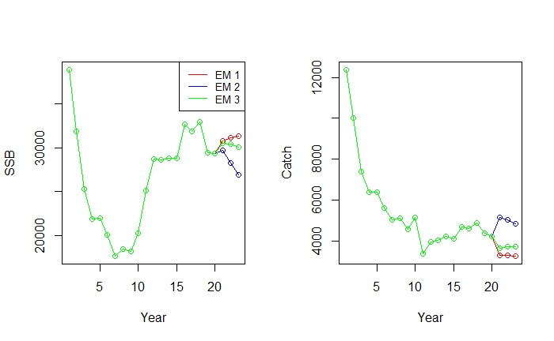

## Hockey-stick Harvest Control Rule

This vignette demonstrates how to use the `whamMSE` (Woods Hole Assessment Model Management Strategy Evaluation) package to apply different types of harvest control rule (HCR) in a management strategy evaluation (MSE). **Note:** all code shown here is for demonstration purposes only; the results are for illustrative use and should not be interpreted as reflecting real-world stock assessments.

### 1. Load `wham` and `whamMSE`

```{r, eval=FALSE}
library(wham)
library(whamMSE)

main.dir = here::here()
```

### 2. Generate Basic Information

```{r, eval=FALSE}
year_start  <- 1
year_end    <- 20
MSE_years   <- 3

info <- generate_basic_info(
  n_stocks = 2,
  n_regions = 2,
  n_indices = 2,
  n_fleets = 2,
  n_seasons = 1,
  base.years = year_start:year_end,
  n_feedback_years = MSE_years,
  life_history = "medium",
  n_ages = 12
)

basic_info = info$basic_info
catch_info = info$catch_info
index_info = info$index_info
F_info     = info$F
```

### 3. Specify Movement

```{r, eval=FALSE}
basic_info <- generate_NAA_where(basic_info, move.type = 2)
move <- generate_move(
  basic_info = basic_info,
  move.type = 2,
  move.rate = c(0.3, 0.1),
  move.re = "constant"
)
```

### 4. Configure Selectivity

```{r, eval=FALSE}
n_stocks  <- as.integer(basic_info['n_stocks'])
n_regions <- as.integer(basic_info['n_regions'])
n_fleets  <- as.integer(basic_info['n_fleets'])
n_indices <- as.integer(basic_info['n_indices'])
n_ages    <- as.integer(basic_info['n_ages'])

fleet_pars <- c(5, 1)
index_pars <- c(2, 1)
sel <- list(
  model = rep("logistic", n_fleets + n_indices),
  initial_pars = c(rep(list(fleet_pars), n_fleets), rep(list(index_pars), n_indices))
)
```

### 5. Configure Numbers-at-Age (NAA)

```{r, eval=FALSE}
sigma      <- "rec+1"
re_cor     <- "iid"
ini.opt    <- "equilibrium"
Rec_sig    <- 0.5
NAA_sig    <- 0.2

sigma_vals <- array(NAA_sig, dim = c(n_stocks, n_regions, n_ages))
sigma_vals[,,1] <- Rec_sig

log_N1    <- rep(10, n_stocks)
log_N1[1] <- log(exp(10) * 2)
N1_pars   <- generate_ini_N1(basic_info, ini.opt, log_N1)

mean_rec_par <- lapply(1:n_stocks, function(i) exp(log_N1[i]))

NAA_re <- list(
  N1_model = rep(ini.opt, n_stocks),
  sigma = rep(sigma, n_stocks),
  cor = rep(re_cor, n_stocks),
  recruit_model = 2,
  recruit_pars = mean_rec_par,
  sigma_vals = sigma_vals,
  N1_pars = N1_pars
)
```

### 6. Generate `wham` Input

```{r, eval=FALSE}
input <- prepare_wham_input(
  basic_info = basic_info,
  selectivity = sel,
  NAA_re = NAA_re,
  move = move,
  catch_info = catch_info,
  index_info = index_info,
  F = F_info,
  age_comp = "logistic-normal-miss0"
)
```

### 7. Generate Operating Model

```{r, eval=FALSE}
random <- input$random
input$random <- NULL
om <- fit_wham(input, do.fit = FALSE, do.brps = TRUE, MakeADFun.silent = TRUE)
```

### 8. Configure Assessment Timing

```{r, eval=FALSE}
assess.interval <- 3
base.years      <- year_start:year_end
terminal.year   <- tail(base.years, 1)
assess.years    <- seq(terminal.year, tail(om$years, 1) - assess.interval, by = assess.interval)
mods <- list()
```

### 9. Re-configure Selectivity and NAA
```{r, eval=FALSE} 
n_stocks = n_regions = n_fleets = n_indices = 1

sel_em <- list(model=rep("logistic", n_fleets + n_indices),
               initial_pars=c(rep(list(fleet_pars), n_fleets), rep(list(index_pars), n_indices)))

NAA_re_em <- list(N1_model="equilibrium", sigma="rec+1", cor="iid")
```

### 10. Run MSE Scenarios. Run MSE Scenarios

#### EM1: Panmictic model with 75% FXSPR

```{r, eval=FALSE}

om_with_data <- update_om_fn(om, seed = 123, random = random)

hcr <- list()
hcr$hcr.type <- 1
hcr$hcr.opts <- list(use_FXSPR = TRUE, percentFXSPR = 75)

mods[[1]] = loop_through_fn(om = om_with_data,
                            em_info = info,
                            random = random,
                            sel_em = sel_em,
                            NAA_re_em = NAA_re_em,
                            move_em = NULL,
                            age_comp_em = "logistic-normal-miss0",
                            em.opt = list(separate.em = TRUE, separate.em.type = 1, do.move = FALSE, est.move = FALSE),
                            aggregate_catch_info = list(n_fleets = 1, fleet_pointer = c(1,1), use_catch_weighted_waa = TRUE, catch_Neff = 100, catch_cv = 0.1),
                            aggregate_index_info = list(n_indices = 1, index_pointer = c(1,1), use_catch_weighted_waa = TRUE, index_Neff = 100, index_cv = 0.1),
                            hcr = hcr,
                            assess_years = assess.years,
                            assess_interval = assess.interval,
                            base_years = base.years,
                            year.use = 20,
                            seed = 123)
```

#### EM2: Panmictic model with 100% FXSPR

```{r, eval=FALSE}
hcr <- list()
hcr$hcr.type <- 1
hcr$hcr.opts <- list(use_FXSPR = TRUE, percentFXSPR = 100)

mods[[2]] = loop_through_fn(om = om_with_data,
                            em_info = info,
                            random = random,
                            sel_em = sel_em,
                            NAA_re_em = NAA_re_em,
                            move_em = NULL,
                            age_comp_em = "logistic-normal-miss0",
                            em.opt = list(separate.em = TRUE, separate.em.type = 1, do.move = FALSE, est.move = FALSE),
                            aggregate_catch_info = list(n_fleets = 1, fleet_pointer = c(1,1), use_catch_weighted_waa = TRUE, catch_Neff = 100, catch_cv = 0.1),
                            aggregate_index_info = list(n_indices = 1, index_pointer = c(1,1), use_catch_weighted_waa = TRUE, index_Neff = 100, index_cv = 0.1),
                            hcr = hcr,
                            assess_years = assess.years,
                            assess_interval = assess.interval,
                            base_years = base.years,
                            year.use = 20,
                            seed = 123)
```

#### EM3: Hockey-stick HCR

```{r, eval=FALSE}
hcr <- list()
hcr$hcr.type <- 3
hcr$hcr.opts <- list(use_FXSPR = TRUE, max_percent = 80, min_percent = 0.01, BThresh_up = 0.5, BThresh_low = 0)

mods[[3]] = loop_through_fn(om = om_with_data,
                            em_info = info,
                            random = random,
                            sel_em = sel_em,
                            NAA_re_em = NAA_re_em,
                            move_em = NULL,
                            age_comp_em = "logistic-normal-miss0",
                            em.opt = list(separate.em = TRUE, separate.em.type = 1, do.move = FALSE, est.move = FALSE),
                            aggregate_catch_info = list(n_fleets = 1, fleet_pointer = c(1,1), use_catch_weighted_waa = TRUE, catch_Neff = 100, catch_cv = 0.1),
                            aggregate_index_info = list(n_indices = 1, index_pointer = c(1,1), use_catch_weighted_waa = TRUE, index_Neff = 100, index_cv = 0.1),
                            hcr = hcr,
                            assess_years = assess.years,
                            assess_interval = assess.interval,
                            base_years = base.years,
                            year.use = 20,
                            seed = 123)
```

### 11. Compare Model Performance

```{r, eval=FALSE}
par(mfrow = c(1,2))
SSB_s1_m1 <- mods[[1]]$om$rep$SSB[,1]
SSB_s1_m2 <- mods[[2]]$om$rep$SSB[,1]
SSB_s1_m3 <- mods[[3]]$om$rep$SSB[,1]
plot(SSB_s1_m1[1:23], col = "red", type = "o", ylab = "SSB", xlab = "Year", ylim = c(0,7e4))
lines(SSB_s1_m2[1:23], col = "blue", type = "o")
lines(SSB_s1_m3[1:23], col = "green", type = "o")
legend("topright", legend = c("EM 1", "EM 2", "EM 3"), col = c("red", "blue", "green"), lty = 1, cex = 0.8)

Catch_r1_m1 <- mods[[1]]$om$rep$pred_catch[,1]
Catch_r1_m2 <- mods[[2]]$om$rep$pred_catch[,1]
Catch_r1_m3 <- mods[[3]]$om$rep$pred_catch[,1]
plot(Catch_r1_m1[1:23], col = "red", type = "o", ylab = "Catch", xlab = "Year", ylim = c(0,1.2e4))
lines(Catch_r1_m2[1:23], col = "blue", type = "o")
lines(Catch_r1_m3[1:23], col = "green", type = "o")
```
{width="600"}