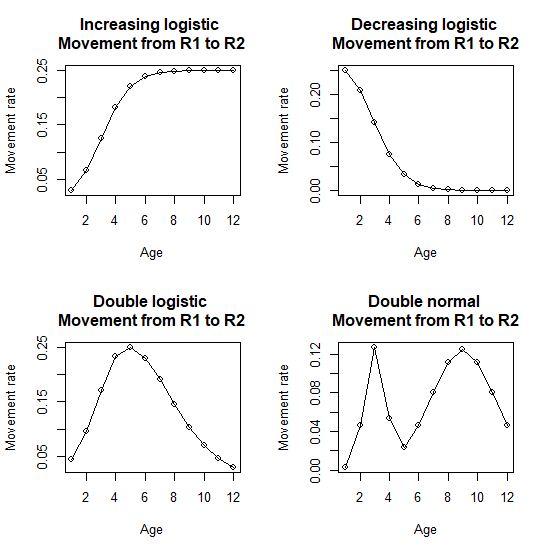
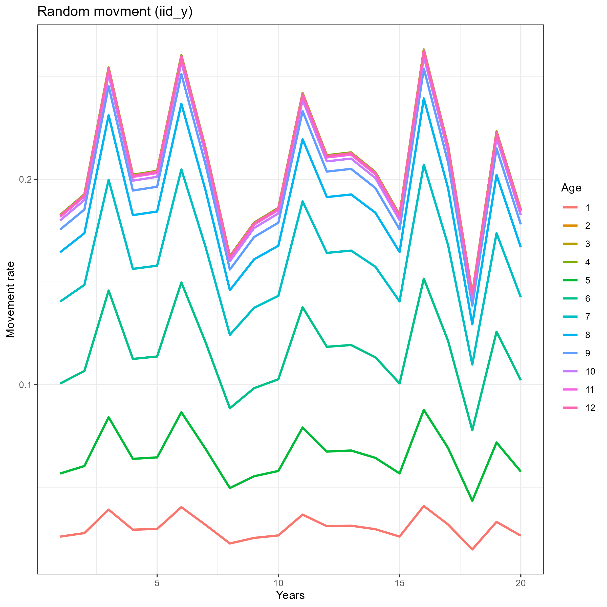
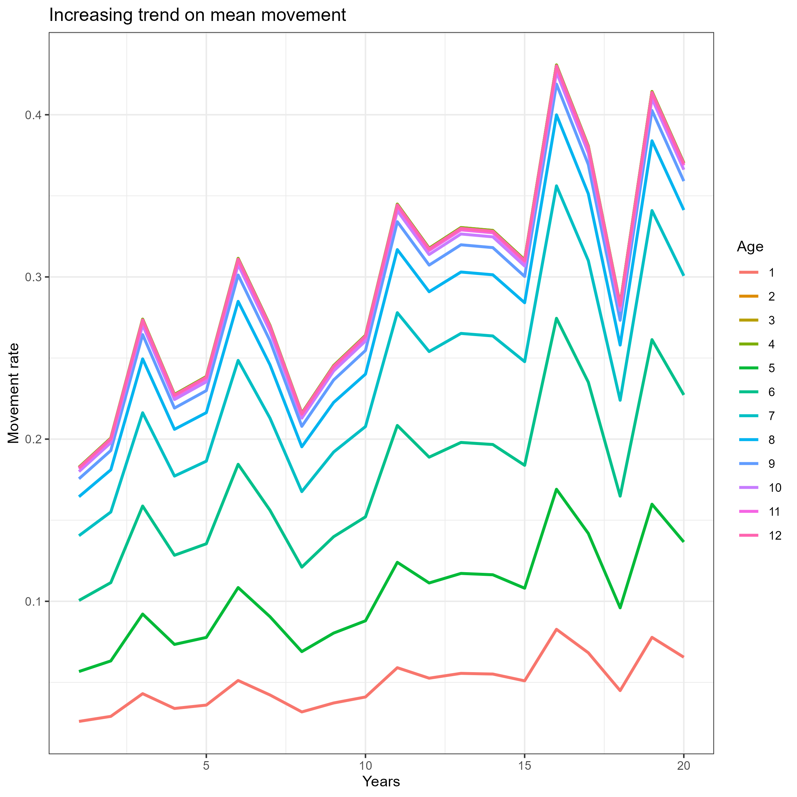
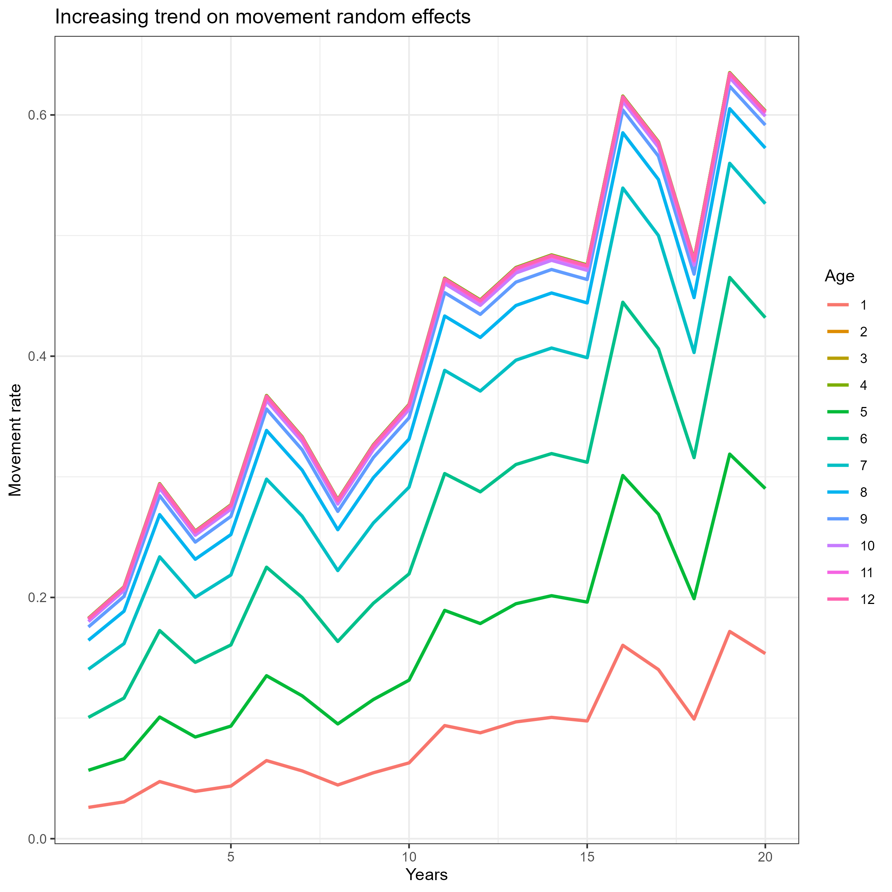

This vignette includes an example of how to specify ontogenetic (age-specific) movement for the operating model:

### 1. Load "WHAM" and "whamMSE":

```{r, eval=FALSE}
library(wham)
library(whamMSE)

main.dir = here::here()
```

### 2. Generate basic information

```{r, eval=FALSE}
info <- generate_basic_info(onto_move = 0, onto_move_pars = 0) 

basic_info = info$basic_info # collect basic information
catch_info = info$catch_info # collect fleet catch information
index_info = info$index_info # collect survey information
F_info = info$F # collect fishing information

# see more details using ?generate_basic_info
```

### 3. Specify movement type and movement rate

```{r, eval=FALSE}
basic_info <- generate_NAA_where(basic_info = basic_info, move.type = 2) # "bidirectional" movement

move <- generate_move(basic_info = basic_info, move.type = 2, move.rate = c(0.2,0.1), move.re = "constant")
```

### 4. Configure numbers-at-age (NAA)

```{r, eval=FALSE}
sigma        <- "rec+1"
re_cor       <- "iid"
ini.opt      <- "equilibrium" 
sigma_vals   <-  array(0.5, dim = c(n_stocks, n_regions, n_ages)) # NAA sigma

NAA_re <- list(N1_model=rep(ini.opt,n_stocks),
               sigma=rep(sigma,n_stocks),
               cor=rep(re_cor,n_stocks),
               recruit_model = 2,  # rec random around the mean
               sigma_vals = sigma_vals) # NAA_where must be specified in basic_info!
```

### 5. Different configurations of ontogenetic movement 

Here we show 4 different options for ontogenetic movement:  

```{r, eval=FALSE}
onto.move.opts = 1:4
onto.move.pars.opts = list(c(2,1,0,0), # increasing logistic
                           c(2,1,0,0), # decreasing logistic
                           c(2,1,6,2), # double logistic
                           c(2,1,8,3)) # double normal
# user specified age-specific movement is also available, please see "age_mu_devs" in the generate_basic_info()
move.names = c("Increasing logistic", "Decreasing logistic", "Double logistic", "Double normal")

```

### 6. Generate operating model and one realization

Here we use `prepare_wham_input()` function to generate a wham input using the basic information we set above:

```{r, eval=FALSE}
par(mfrow = c(2,2))
for (i in 1:4){
  
  info <- generate_basic_info(onto_move = onto.move.opts[i], onto_move_pars = onto.move.pars.opts[[i]]) 
  print(info$basic_info$onto_move)
  print(info$basic_info$onto_move_pars)
  basic_info = info$basic_info # collect basic information
  
  input <- prepare_wham_input(basic_info = basic_info, NAA_re = NAA_re, move = move, 
                              catch_info = catch_info, index_info = index_info, F = F_info)
  random = input$random # check what processes are random effects
  input$random = NULL # so inner optimization won't change simulated RE
  om <- fit_wham(input, do.fit = F, do.brps = T, MakeADFun.silent = TRUE)
  # Note: do.fit must be FALSE (no modeling fitting yet)
  set.seed(123)
  input <- om$input
  input$data <- om$simulate(complete=TRUE)
  plot(exp(input$data$trans_mu_base)[1,1:12,1,1,1,1], type = "o", ylab = "Movement rate", xlab = "Age",
     main = paste(move.names[i],"\nMovement from R1 to R2"))
  # plot(exp(input$data$trans_mu_base)[2,1:12,1,1,2,1], type = "o", ylab = "movement rate", xlab = "Year",
  #    main = paste(move.names[i], "\nMovement from R2 to R1"))
}
```
{width="600"}

### 7. Ontogenetic movement as random effects

Here is an example showing ontogenetic movement rates treated as IID random effects:

```{r, eval=FALSE}
move <- generate_move(basic_info = basic_info, move.type = 2, 
                      move.rate = c(0.2,0.1), move.re = "iid_y")

info <- generate_basic_info(onto_move = 1, onto_move_pars = c(2,1,0,0)) # increasing logistic

basic_info = info$basic_info # collect basic information

input <- prepare_wham_input(basic_info = basic_info, NAA_re = NAA_re, move = move, 
                            catch_info = catch_info, index_info = index_info, F = F_info)
random = input$random # check what processes are random effects
input$random = NULL # so inner optimization won't change simulated RE
om <- fit_wham(input, do.fit = F, do.brps = T, MakeADFun.silent = TRUE)
set.seed(123)
input <- om$input
input$data <- om$simulate(complete=TRUE)

movement_data <- data.frame(t(input$data$mu[1,,1,,1,2]))
movement_data$Years <- input$years
names(movement_data) <- c(1:12,"Years")

library(dplyr)
library(tidyr)
library(ggplot2)

data <- movement_data %>% 
  pivot_longer(cols = -Years, names_to = "Age", values_to = "Move_rate") %>%
  mutate(Age = as.factor(Age))

levels(data$Age) = 1:12

p <- ggplot(data, aes(x = Years, y = Move_rate, color = factor(Age))) +
  geom_line(size = 1) +
  scale_color_discrete(name = "Age") + 
  theme_bw() +
  labs(title = "Random movment (iid_y)", x = "Years", y = "Movement rate")
print(p)
# ggsave("ontogenetic_random_movement.png", width = 8, height = 8)

```
{width="600"}

### 8. Movement with an increasing trend over years

Here are 2 examples showing how to model movement with an increasing trend over years.

Users can apply an increasing trend on mean movement rate directly:
```{r, eval=FALSE}
# Increasing trend applied on the mean movement directly
move <- generate_move(basic_info = basic_info, move.type = 2, 
                      move.rate = c(0.2,0.1), move.re = "iid_y")

info <- generate_basic_info(onto_move = 1, onto_move_pars = c(2,1,0,0),  # increasing logistic
                            apply_mu_trend = 1, # trend applied on the mean movement
                            trend_mu_rate = 0.05) # annual rate of 0.05 

basic_info = info$basic_info # collect basic information

input <- prepare_wham_input(basic_info = basic_info, NAA_re = NAA_re, move = move, 
                            catch_info = catch_info, index_info = index_info, F = F_info)
random = input$random # check what processes are random effects
input$random = NULL # so inner optimization won't change simulated RE
om <- fit_wham(input, do.fit = F, do.brps = T, MakeADFun.silent = TRUE)
set.seed(123)
input <- om$input
input$data <- om$simulate(complete=TRUE)

movement_data <- data.frame(t(input$data$mu[1,,1,,1,2]))
movement_data$Years <- input$years
names(movement_data) <- c(1:12,"Years")

library(dplyr)
library(tidyr)
library(ggplot2)

data <- movement_data %>% 
  pivot_longer(cols = -Years, names_to = "Age", values_to = "Move_rate") %>%
  mutate(Age = as.factor(Age))

levels(data$Age) = 1:12

p <- ggplot(data, aes(x = Years, y = Move_rate, color = factor(Age))) +
  geom_line(size = 1) +
  scale_color_discrete(name = "Age") + 
  theme_bw() +
  labs(title = "Increasing trend on mean movement", x = "Years", y = "Movement rate")
print(p)
# ggsave("ontogenetic_random_movement_mu_increasing.png", width = 8, height = 8)
```
{width="600"}


Users can also apply an increasing trend on movement random effects:
```{r, eval=FALSE}
# Increasing trend applied on movement random effects 
info <- generate_basic_info(onto_move = 1, onto_move_pars = c(2,1,0,0),  # increasing logistic
                            apply_re_trend = 1, # trend applied to movement random effects
                            trend_re_rate = 0.1) # annual rate of 0.1

basic_info = info$basic_info # collect basic information

input <- prepare_wham_input(basic_info = basic_info, NAA_re = NAA_re, move = move, 
                            catch_info = catch_info, index_info = index_info, F = F_info)
random = input$random # check what processes are random effects
input$random = NULL # so inner optimization won't change simulated RE
om <- fit_wham(input, do.fit = F, do.brps = T, MakeADFun.silent = TRUE)
set.seed(123)
input <- om$input
input$data <- om$simulate(complete=TRUE)

movement_data <- data.frame(t(input$data$mu[1,,1,,1,2]))
movement_data$Years <- input$years
names(movement_data) <- c(1:12,"Years")

data <- movement_data %>% 
  pivot_longer(cols = -Years, names_to = "Age", values_to = "Move_rate") %>%
  mutate(Age = as.factor(Age))

levels(data$Age) = 1:12

p <- ggplot(data, aes(x = Years, y = Move_rate, color = factor(Age))) +
  geom_line(size = 1) +
  scale_color_discrete(name = "Age") + 
  theme_bw() +
  labs(title = "Increasing trend on movement random effects", x = "Years", y = "Movement rate")
print(p)
# ggsave("ontogenetic_random_movement_re_increasing.png", width = 8, height = 8)

```
{width="600"}